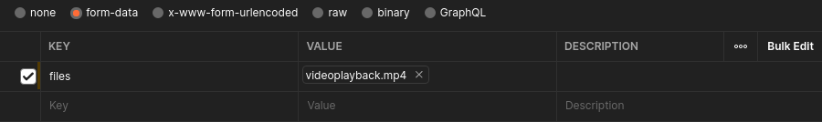
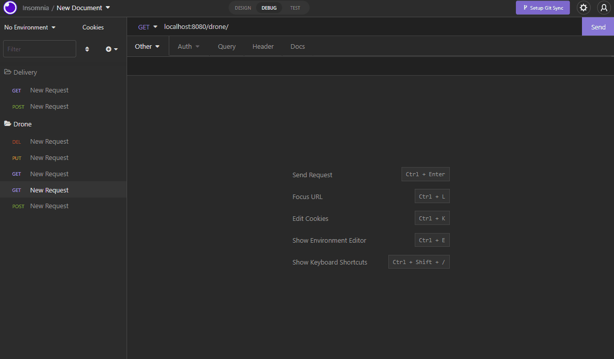
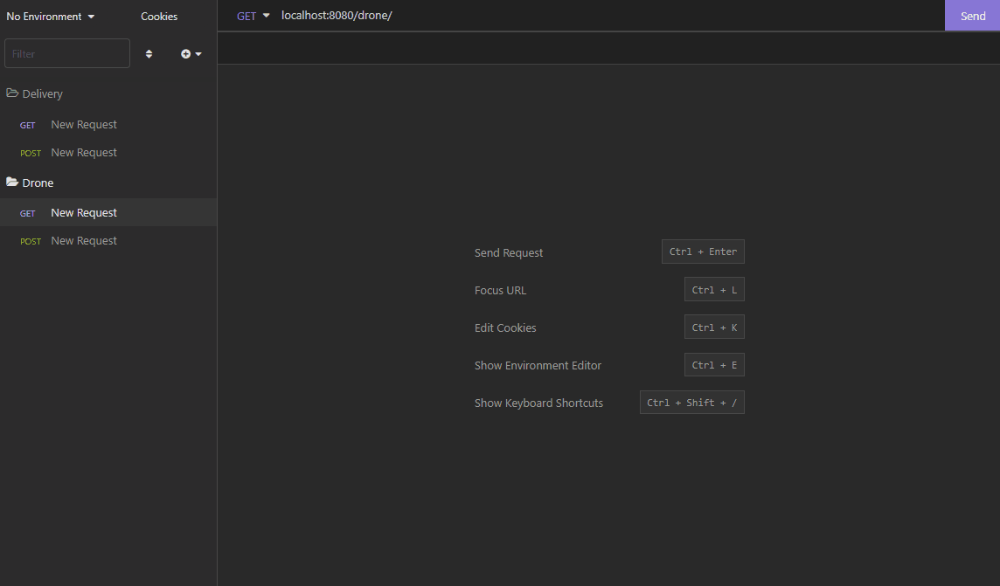
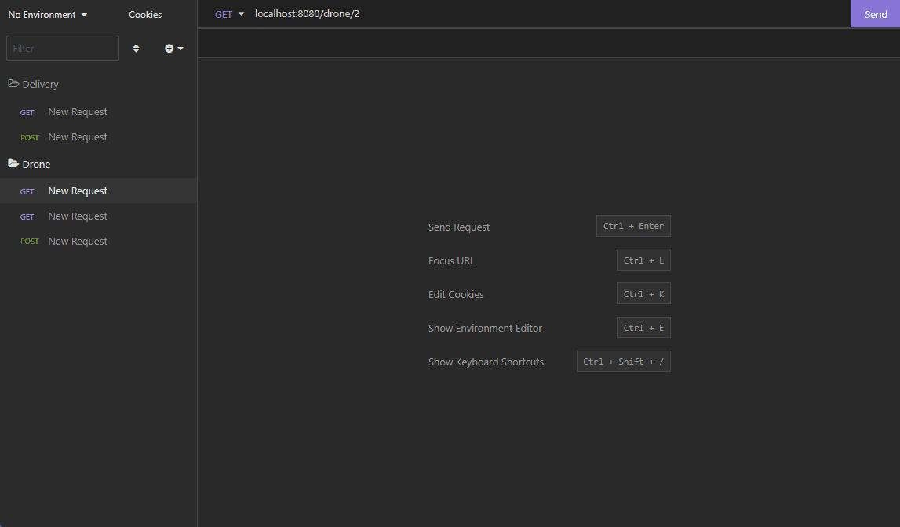
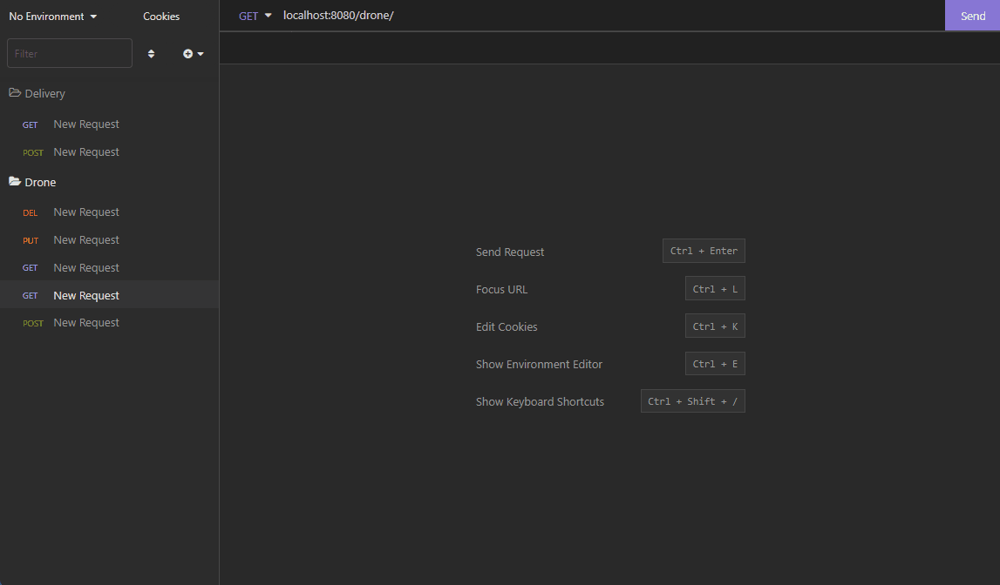

# drone-feeder

## Contexto:

Um aplicativo Spring que simula uma empresa de logística que faz uso de drones para as suas entregas.
Nela é possível utilizar CRUD para os drones e para as entregas, além de possuir a funcionalidade de fazer upload e download de vídeos gravados pelos drones no momento da entrega.

## Tecnologias Usadas:

>Java, Spring, Hibernate, Persistence, H2, Mockito, MockMvc, Junit, Docker, Docker-Compose, MySQL, eficode/wait-for


## Instruções:
Para usar o aplicativo (Necessita do Java JDK 11 instalado):

```sh
git clone git@github.com:luigrosz/drone-feeder.git
```

Utilizando Docker (Spring e MySQL):

```git
./mvnw clean package && docker compose up --build
```

Executando na máquina (Spring e H2 Database) :

```git
./mvnw clean package && java -jar /target/*.jar
```

### Exemplos:

##### Video endpoint (POST e GET):

```html
https://localhost:8080/video/upload
```

Corpo (POST):



Resposta (POST):

```json
[
    {
        "fileName": "videoplayback.mp4",
        "downloadUrl": "http://localhost:8080/video/download/videoplayback.mp4"
    }
]
```

<div align="center">


</div>

##### Drone endpoint (POST):

```html
https://localhost:8080/drone
```

Corpo:

```json
{
    "latitude": "47.7",
    "longitude": "3.2",
    "lastMaintenance": "2022-07-18"
}
```

```json
{
    "id": 13,
    "latitude": "47.7",
    "longitude": "3.2",
    "lastMaintenance": "2022-07-18",
    "deliveries": null
}
```



##### Drone endpoint (GET):

```html
https://localhost:8080/drone
```
    
Resposta:

```json
[
    {
        "id": 1,
        "latitude": "90.0",
        "longitude": "180.0",
        "lastMaintenance": "2022-07-16",
        "deliveries": [
            {
                "id": 3,
                "delivery": "Mouse",
                "time": "12"
            }
        ]
    },
    {
        "id": 2,
        "latitude": "47.7",
        "longitude": "3.2",
        "lastMaintenance": "2022-07-18",
        "deliveries": [
            {
                "id": 4,
                "delivery": "Monitor",
                "time": "10"
            },
            {
                "id": 5,
                "delivery": "Computador",
                "time": "17"
            }
        ]
    }
]
```



###### Drone endpoint (GET):

```html
https://localhost:8080/drone/2
```

Resposta:

```json
{
    "id": 2,
    "latitude": "47.7",
    "longitude": "3.2",
    "lastMaintenance": "2022-07-18",
    "deliveries": [
        {
            "id": 4,
            "delivery": "Monitor",
            "time": "10"
        },
        {
            "id": 5,
            "delivery": "Computador",
            "time": "17"
        }
    ]
}
```     



###### Drone endpoint (PUT):

```html
https://localhost:8080/drone/2
```

Corpo:

```json
{
    "latitude": "90.0",
    "longitude": "23.3",
    "lastMaintenance": "2022-07-18"
}
```

Resposta:

```json
{
    "id": 2,
    "latitude": "90.0",
    "longitude": "23.3",
    "lastMaintenance": "2022-07-18",
    "deliveries": [
        {
            "id": 4,
            "delivery": "Monitor",
            "time": "10"
        },
        {
            "id": 5,
            "delivery": "Computador",
            "time": "17"
        }
    ]
}
```


##### Drone endpoint (DELETE):

```html
https://localhost:8080/drone/1
```

Resposta:

```json
{
    "id": 1,
    "latitude": "90.0",
    "longitude": "180.0",
    "lastMaintenance": "2022-07-16",
    "deliveries": [
        {
            "id": 3,
            "delivery": "Mouse",
            "time": "12"
        }
    ]
}
```


